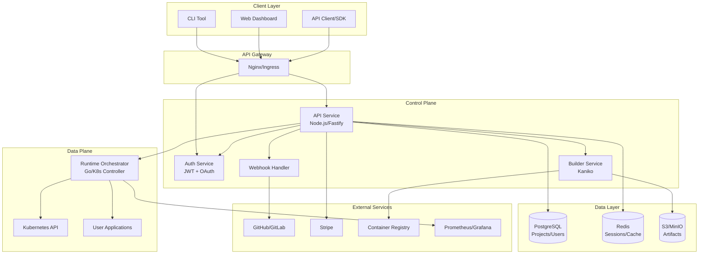
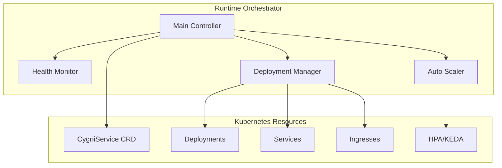
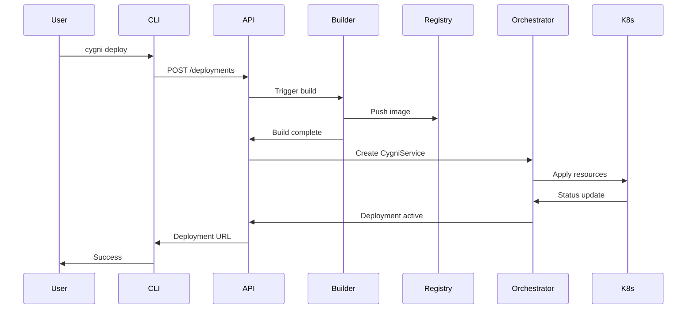
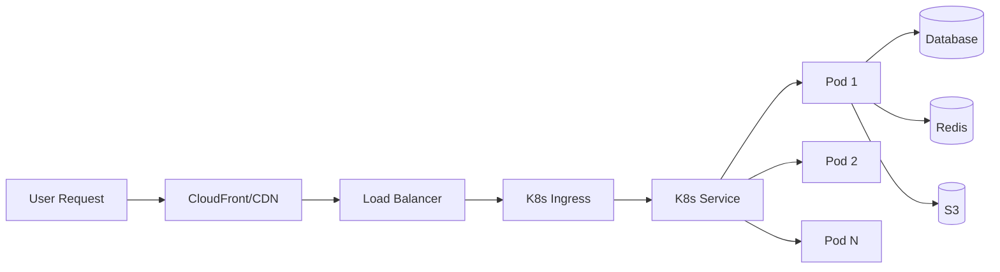
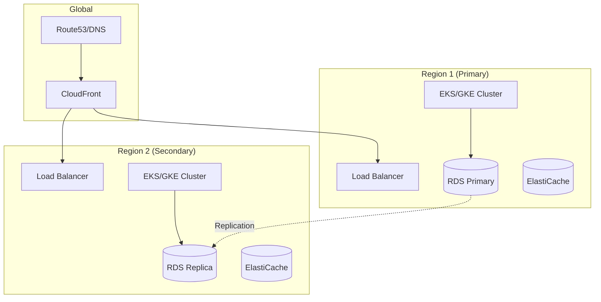
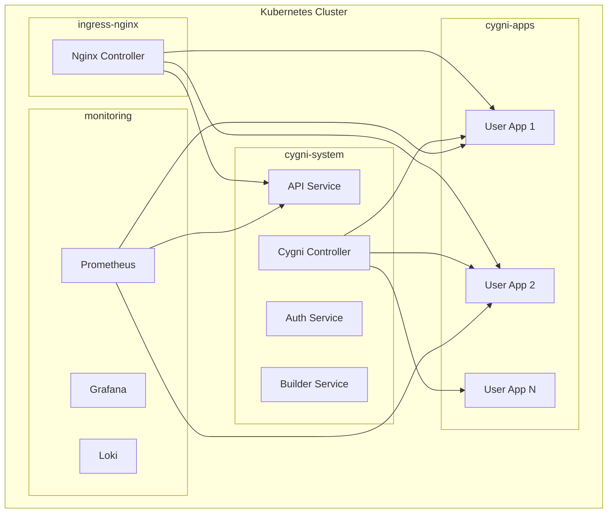
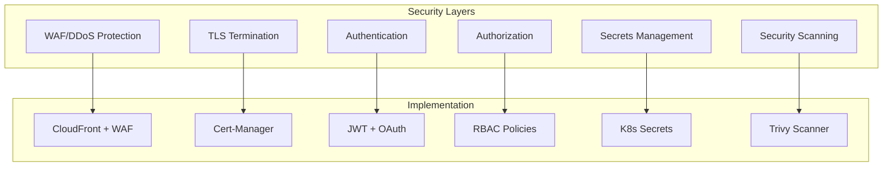

# Cygni Architecture

## Table of Contents

1. [Overview](#overview)
2. [System Architecture](#system-architecture)
3. [Project Structure](#project-structure)
4. [Service Architecture](#service-architecture)
5. [Data Flow](#data-flow)
6. [Deployment Architecture](#deployment-architecture)
7. [Technology Stack](#technology-stack)

## Overview

Cygni is a modern Platform-as-a-Service (PaaS) that simplifies cloud deployments while maintaining the flexibility of major cloud providers. It follows a microservices architecture with clear separation of concerns.

## System Architecture



## Project Structure

```
Cygni/
 .github/                    # GitHub Actions workflows
    workflows/
        ci.yml             # Main CI pipeline
        release.yml        # Release automation
        security.yml       # Security scanning

 packages/                   # Shared packages (pnpm workspace)
    api/                   # API client library
    cli/                   # CLI tool
    sdk/                   # JavaScript/TypeScript SDK
    landing/               # Marketing website
    web-ui/                # Dashboard UI (Next.js)

 services/                   # Microservices
    api/                   # Main API service
       src/
          routes/       # API endpoints
          services/     # Business logic
          middleware/   # Auth, rate limiting
          utils/        # Helpers
       prisma/           # Database schema

    auth/                  # Authentication service
       src/
           providers/    # OAuth providers
           jwt/          # JWT management

    builder/               # Build service
       src/
           kaniko/       # Container builder

    runtime-orchestrator/  # Kubernetes controller
        api/              # CRD definitions
        controllers/      # K8s controllers
        config/           # K8s manifests

 infrastructure/             # Infrastructure as Code
    kubernetes/            # K8s manifests
       base/            # Base configurations
       overlays/        # Environment-specific
    terraform/            # Cloud infrastructure
    helm/                # Helm charts

 scripts/                   # Utility scripts
    setup-*.sh           # Setup scripts
    test-suite/          # Test scripts

 docs/                      # Documentation
     api/                  # API docs
     guides/               # User guides
     architecture/         # Architecture docs
```

## Service Architecture

### API Service

```mermaid
graph LR
    subgraph "API Service"
        ROUTES[Routes]
        MW[Middleware]
        SVC[Services]
        DB[Database]

        ROUTES --> MW
        MW --> SVC
        SVC --> DB
    end

    subgraph "Routes"
        AUTH_R[/auth]
        PROJ_R[/projects]
        DEPLOY_R[/deployments]
        BUILD_R[/builds]
    end

    subgraph "Services"
        AUTH_S[AuthService]
        PROJ_S[ProjectService]
        DEPLOY_S[DeploymentService]
        BILLING_S[BillingService]
    end
```

### Runtime Orchestrator



## Data Flow

### Deployment Flow



### Request Flow



## Deployment Architecture

### Multi-Region Setup



### Kubernetes Architecture



## Technology Stack

### Core Technologies

- **Languages**: TypeScript (Node.js), Go
- **Frameworks**: Fastify, Next.js, controller-runtime
- **Database**: PostgreSQL (Prisma ORM)
- **Cache**: Redis
- **Container**: Docker, Kaniko
- **Orchestration**: Kubernetes
- **Cloud**: AWS/GCP/Azure agnostic

### Infrastructure

- **CI/CD**: GitHub Actions
- **Monitoring**: Prometheus + Grafana
- **Logging**: Loki
- **Tracing**: OpenTelemetry
- **Security**: Trivy, OWASP, CodeQL

### Development Tools

- **Package Manager**: pnpm (workspaces)
- **Build Tool**: Turbo
- **Testing**: Jest, Go testing
- **Linting**: ESLint, golangci-lint
- **Type Checking**: TypeScript

## Design Principles

1. **Cloud Native**: Built for Kubernetes from the ground up
2. **Microservices**: Clear service boundaries and responsibilities
3. **API First**: All functionality exposed via REST APIs
4. **Developer Experience**: Simple CLI, clear documentation
5. **Production Ready**: Health checks, monitoring, auto-scaling
6. **Multi-Tenant**: Secure isolation between customers
7. **Extensible**: Plugin architecture for custom builders

## Security Architecture



## Scaling Strategy

- **Horizontal Scaling**: KEDA for advanced metrics
- **Vertical Scaling**: Resource recommendations
- **Database Scaling**: Read replicas, connection pooling
- **Caching**: Multi-layer (CDN, Redis, application)
- **Auto-scaling Policies**: CPU, memory, request rate, custom metrics

## Future Architecture Considerations

1. **Edge Computing**: Deploy to edge locations
2. **Serverless Functions**: Lambda/Cloud Functions support
3. **AI/ML Workloads**: GPU support and ML pipelines
4. **Multi-Cloud**: Single control plane for multiple clouds
5. **GitOps**: Flux/ArgoCD integration
